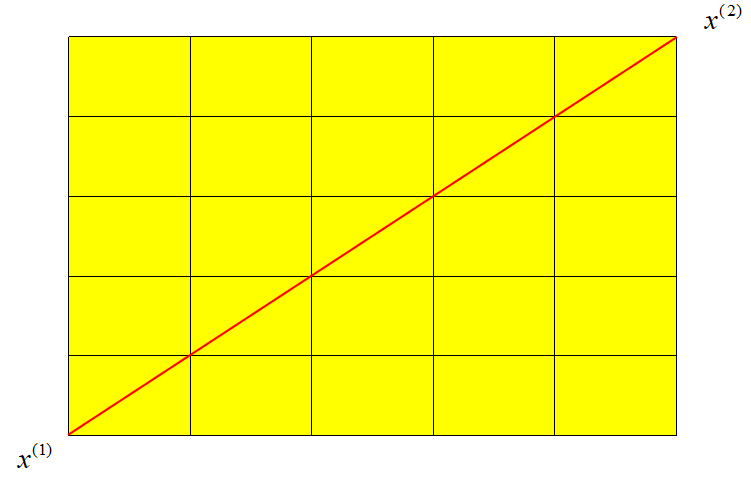
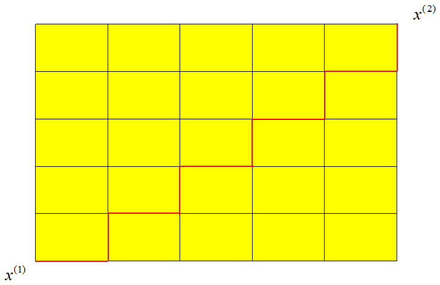
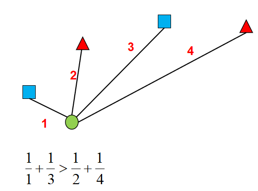

# 4.2:k-近邻算法原理

我们已经知道，如何判别一个样本属于哪个类型，主要是看离它最近的几个样本中哪个类型的数量最多，则该样本属于数量最多的类型。这里，存在两个问题：

- 何为最近
- 如果有两个类型的样本数一样且最多，那么最终该样本应该属于哪个类型

### 距离度量

关于何为最近，大家应该自然而然就会想到可以用两个样本之间的距离大小来衡量，我们常用的有两种距离：

- 欧氏距离：欧氏距离是最容易直观理解的距离度量方法，我们小学、初中和高中接触到的两个点在空间中的距离一般都是指欧氏距离。



二维平面上欧式距离计算公式：

$$
d_{12} = \sqrt{(x^{(1)}_1-x^{(2)}_1)^2+(x^{(1)}_2-x^{(2)}_2)^2}
$$

`n`维平面上欧氏距离计算公式：

$$
d_{12}=\sqrt{\sum\limits_{i=1}^n(x^{(1)}_i-x^{(2)}_i)^2}
$$

- 曼哈顿距离：顾名思义，在曼哈顿街区要从一个十字路口开车到另一个十字路口，驾驶距离显然不是两点间的直线距离。这个实际驾驶距离就是“曼哈顿距离”。曼哈顿距离也称为“城市街区距离”。



二维平面上曼哈顿距离计算公式：

$$
d_{12}=|x^{(1)}_1-x^{(2)}_1|+|x^{(1)}_2-x^{(2)}_2|
$$

`n`维平面上曼哈顿计算公式：

$$
d_{12}=\sum\limits_{i=1}^n|x^{(1)}_i-x^{(2)}_i|
$$

### 加权投票

`knn`算法最后决定样本属于哪个类别，其实好比就是在投票，哪个类别票数多，则该样本属于哪个类别。而如果出现票数相同的情况，我们可以给每一票加上一个权重，用来表示每一票的重要性，这样就可以解决票数相同的问题了。很明显，距离越近的样本所投的一票应该越重要，此时我们可以将距离的倒数作为权重赋予每一票。



如上图，虽然蓝色正方形与红色三角形数量一样，但是根据加权投票的规则，绿色的圆应该属于蓝色正方形这个类别。