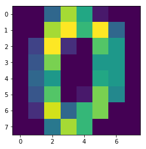

# 4.5:实战案例

### 手写数字数据

手写数字数据集一共有`1797`个样本，每个样本有`64`个特征。每个特征的值为`0-255`之间的像素，我们的任务就是根据这`64`个特征值识别出该数字属于`0-9`十个类别中的哪一个。

我们可以使用`sklearn`直接对数据进行加载，代码如下：

```python
from sklearn.datasets import load_digits
#加载手写数字数据集
digits = load_digits()
#获取数据特征与标签
x,y = digits .data,digits .target
```

当然，每一个样本就是一个数字，我们可以把它还原为`8x8`的大小进行查看：

```python
import matplotlib.pyplot as plt

img = x[0].reshape(8,8)
plt.imshow(img)
```




然后我们划分出训练集与测试集，训练集用来训练模型，测试集用来检测模型性能。代码如下：

```python
from sklearn.model_selection import train_test_split
#划分训练集测试集，其中测试集样本数为整个数据集的20%
train_feature,test_feature,train_label,test_label = train_test_split(x,y,test_size=0.2,random_state=666)
```

### 进行识别

接下来就只需要调用之前实现的`knn_clf`方法就可以对测试集的手写数字进行识别了：

```python
predict = knn_clf(3,train_feature,train_label,test_feature)
predict
>>>array([1, 5, 0, 7, 1, 0, 6, 1, 5, 4, 9, 2, 7, 8, 4, 6, 9, 3, 7, 4, 7, 1,
       8, 6, 0, 9, 6, 1, 3, 7, 5, 9, 8, 3, 2, 8, 8, 1, 1, 0, 7, 9, 0, 0,
       8, 7, 2, 7, 4, 3, 4, 3, 4, 0, 4, 7, 0, 5, 5, 5, 2, 1, 7, 0, 5, 1,
       8, 3, 3, 4, 0, 3, 7, 4, 3, 4, 2, 9, 7, 3, 2, 5, 3, 4, 1, 5, 5, 2,
       9, 2, 2, 2, 2, 7, 0, 8, 1, 7, 4, 2, 3, 8, 2, 3, 3, 0, 2, 9, 9, 2,
       3, 2, 8, 1, 1, 9, 1, 2, 0, 4, 8, 5, 4, 4, 7, 6, 7, 6, 6, 1, 7, 5,
       6, 3, 8, 3, 7, 1, 8, 5, 3, 4, 7, 8, 5, 0, 6, 0, 6, 3, 7, 6, 5, 6,
       2, 2, 2, 3, 0, 7, 6, 5, 6, 4, 1, 0, 6, 0, 6, 4, 0, 9, 3, 8, 1, 2,
       3, 1, 9, 0, 7, 6, 2, 9, 3, 5, 3, 4, 6, 3, 3, 7, 4, 9, 2, 7, 6, 1,
       6, 8, 4, 0, 3, 1, 0, 9, 9, 9, 0, 1, 8, 6, 8, 0, 9, 5, 9, 8, 2, 3,
       5, 3, 0, 8, 7, 4, 0, 3, 3, 3, 6, 3, 3, 2, 9, 1, 6, 9, 0, 4, 2, 2,
       7, 9, 1, 6, 7, 6, 3, 9, 1, 9, 3, 4, 0, 6, 4, 8, 5, 3, 6, 3, 1, 4,
       0, 4, 4, 8, 7, 9, 1, 5, 2, 7, 0, 9, 0, 4, 4, 0, 1, 0, 6, 4, 2, 8,
       5, 0, 2, 6, 0, 1, 8, 2, 0, 9, 5, 6, 2, 0, 5, 0, 9, 1, 4, 7, 1, 7,
       0, 6, 6, 8, 0, 2, 2, 6, 9, 9, 7, 5, 1, 7, 6, 4, 6, 1, 9, 4, 7, 1,
       3, 7, 8, 1, 6, 9, 8, 3, 2, 4, 8, 7, 5, 5, 6, 9, 9, 8, 5, 0, 0, 4,
       9, 3, 0, 4, 9, 4, 2, 5])
```

再根据测试集标签即真实分类结果，计算出正确率：

```python
acc = np.mean(predict==test_label)
acc
>>>0.994
```

可以看到，使用`knn`对手写数字进行识别，正确率能达到`99%`以上。