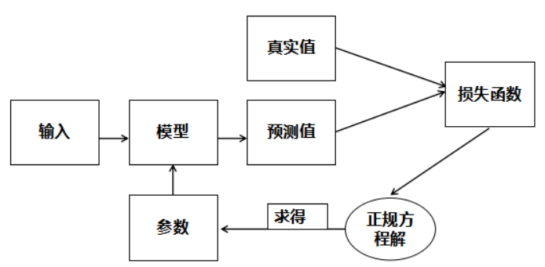

# 5.2:线性回归算法原理

### 线性回归训练流程

我们已经知道线性回归模型如下：

$$
y = b +w_1x_1+w_2x_2+...+w_nx_n
$$

为了方便，我们稍微将模型进行变换：

$$
y = w_0x_0 +w_1x_1+w_2x_2+...+w_nx_n
$$

其中`x0=1`,`w0=b`,通过向量化公式可写成如下形式：

$$
Y=X.W
$$

$$
W = (w_0,w_1,...,w_n)
$$

$$
X = (1,x_1,...,x_n)
$$

而我们的目的就是找出能够正确预测的多元线性回归模型，即找出正确的`W`（即权重与偏置）。那么如何寻找呢？通常在监督学习里面都会使用这么一个套路，构造一个损失函数，用来衡量真实值与预测值之间的差异，然后将问题转化为最优化损失函数。既然损失函数是用来衡量真实值与预测值之间的差异那么很多人自然而然的想到了用所有真实值与预测值的差的绝对值来表示损失函数。不过带绝对值的函数不容易求导，所以采用`MSE`(均方误差)作为损失函数，公式如下：

$$
loss = \frac{1}{m}\sum\limits_{i=1}^m(y^{(i)}-p^{(i)})^2
$$

其中`p`表示预测值，`y`表示真实值，`m`为样本总个数，`i`表示第`i`个样本。最后，我们再使用**正规方程解**来求得我们所需要的参数。

线性回归模型训练流程图如下：

### 正规方程解

对线性回归模型，假设训练集中`m`个训练样本，每个训练样本中有`n`个特征，可以使用矩阵的表示方法，预测函数可以写为：

$$
Y = X.W
$$

其损失函数可以表示为

$$
loss = \frac{1}{m}(Y-X.W)^T(Y-X.W)
$$

其中，标签`Y`为`m`行`1`列的矩阵，训练特征`X`为`m`行`(n+1)`列的矩阵，回归系数`W`为`(n+1)`行`1`列的矩阵，对`W`求导，并令其导数为零可解得：

$$
W=(X^TX)^{-1}X^TY
$$

这个就是正规方程解，我们可以通过正规方程解直接求得我们所需要的参数。

