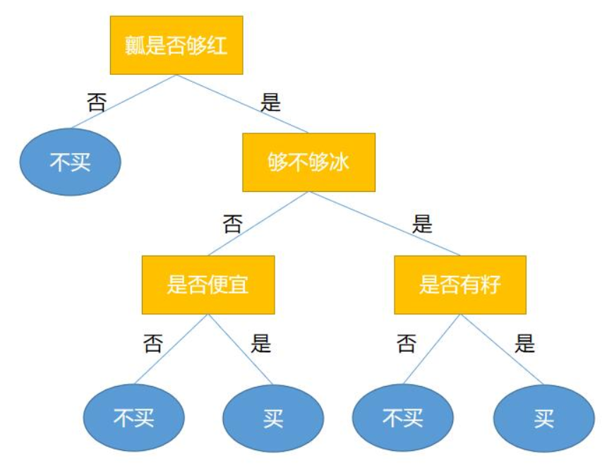

# 6.1:决策树算法思想

决策树是一种可以用于分类与回归的机器学习算法，但主要用于分类。用于分类的决策树是一种描述对实例进行分类的树形结构。决策树由**结点**和**边**组成，其中结点分为**内部结点**和**叶子结点**，**内部结点表示一个特征或者属性，叶子结点表示标签。**

**决策树**说通俗点就是一棵能够替我们做决策的树，或者说是我们人类在要做决策时脑回路的一种表现形式，我们可以从下面这个例子来了解决策树是什么。

在炎热的夏天，没有什么比冰镇后的西瓜更能令人感到心旷神怡的了。现在我要去水果店买西瓜，但怎样我才会买这个西瓜呢？那么，有可能我会有以下这个决策过程：

假设现在水果店里有`3`个西瓜，它们的属性如下：

| 编号 | 瓤是否够红 | 够不够冰 | 是否便宜 | 是否有籽 |
| --- | --- | --- | --- | --- |
| 1 | 是 | 否 | 是 | 否 |
| 2 | 是 | 是 | 否 | 是 |
| 3 | 否 | 是 | 是 | 否 |

那么根据我的决策过程我会买`1`和`2`号西瓜。这个帮助我选择西瓜的过程，就是一个**决策树**。由之前介绍的知识可以知道，黄色部分为内部节点，蓝色部分为叶子节点。