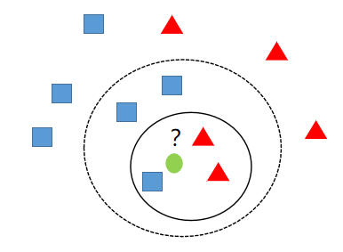

# 4.1:k-近邻算法思想

k-近邻`（k-nearest neighbor ,knn）`是一种分类与回归的方法。我们这里只讨论用来分类的`knn`。所谓`k`最近邻，就是`k`个最近的邻居的意思，说的是每个样本都可以用它最近的`k`个邻居来代表。

`knn`算法的核心思想是如果一个样本在特征空间中的`k`个最相邻的样本中的大多数属于某一个类别，则该样本也属于这个类别，并具有这个类别上样本的特性。该方法在确定分类决策上只依据最邻近的一个或者几个样本的类别来决定待分样本所属的类别。`knn`方法在类别决策时，只与极少量的相邻样本有关。

如上图，当`k=3`时离绿色的圆最近的三个样本中，有两个红色的三角形，一个蓝色的正方形，则此时绿色的圆应该分为红色的三角形这一类。而当`k=5`时，离绿色的圆最近的五个样本中，有两个红色的三角形，三个蓝色的正方形，则此时绿色的圆应该分为蓝色的正方形这一类。

用一句话来总结`knn`算法的思想就是**近朱者赤近墨者黑**。