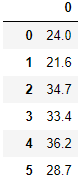

# 5.5:实战案例

### 波士顿房价数据

波士顿房价数据集共有`506`条房价数据，每条数据包括对指定房屋的`13`项数值型特征和目标房价组成。我们需要通过数据特征来对目标房价进行预测。

数据集中部分数据与标签如下图所示：




`sklearn`中已经提供了波士顿房价数据集的相关接口，想要使用该数据集可以使用如下代码：

```python
from sklearn import datasets
#加载波士顿房价数据集
boston = datasets.load_boston()
#X表示特征，y表示目标房价
x = boston.data
y = boston.target
```

然后再对数据集进行划分：

```python
from sklearn.model_selection import train_test_split
#划分训练集测试集，所有样本的20%作为测试集
train_feature,test_feature,train_label,test_label = train_test_split(x,y,test_size=0.2,random_state=666)
```

### 进行预测

同样的只需要调用之前实现线性回归方法就可以对测试集的波士顿房价数据进行预测了：

```python
predict = lr(train_feature,train_label,test_feature)
>>>predict
array([27.14328365, 23.03653632, 27.00098113, 34.67246356, 22.9249281 ,
       21.27666411, 15.67682012, 23.71041177, 24.9170328 , 18.94485146,
        4.21475157, 24.91145159, 20.98995302, 18.43508891, 24.17666486,
       26.84239278, 27.83397467, 13.52699359, 18.45498398, 28.42388411,
       30.59256907, 13.41724252,  8.12085396, 35.51572129, 25.67615918,
       17.16601994, 20.37433719, 13.09756854, 34.29369038, 23.73452722,
       39.80575322,  8.23996654, 24.79976309, 17.93534789, 23.166615  ,
       19.77561659, 35.15958711, 35.62614752, 21.48402467, 13.53651885,
       23.8764859 , 22.76090085, 27.69433621, 18.25312903, 28.24166439,
       11.37889658, 27.10532052, 32.76787747, 29.42762069, 24.90135914,
       27.29432351, 33.19296658, 26.14048342, 23.62626694, 27.59078519,
       20.00241919, 14.46427082, 20.0119397 , 19.81015781, 13.93309224,
       20.96227953, 25.93383085, 30.17587814, 18.06438076, 12.03215906,
       11.3801673 , 26.81093528, 22.56148123, 22.95599483, 25.79865129,
       10.10532755, 33.63114297, 17.81932257, 17.21896388, 39.33351986,
       14.91994896, 18.19524145, 24.94373123, 20.09101825, 31.48389087,
       32.8430831 , 23.95919903,  9.77345135, 31.55307878, 30.55370904,
       23.20332797, 21.90050123, 13.5557125 , 18.27957707, 25.0240593 ,
       19.54159097, 36.39430746, 24.02473259, 33.08973723, 21.71311184,
       17.37919862, 26.67885309, 27.42896672, 13.1943355 ,  0.57642556,
       19.69396665, 14.18869608])
```

### 衡量线性回归的性能指标

对于分类问题，我们可以使用正确率来衡量模型的性能好坏，很明显，回归问题并不能使用正确率来衡量，那么，回归问题可以使用哪些指标用来评估呢？

#### MSE

`MSE （Mean Squared Error）`叫做均方误差,公式如下：

$$
mse = \frac{1}{m}\sum\limits_{i=1}^m(y^{(i)}-p^{(i)})^2
$$

其中`yi`表示第`i`个样本的真实标签，`pi`表示第`i`个样本的预测标签。线性回归的目的就是让损失函数最小。那么，模型训练出来了，我们再测试集上用损失函数来评估也是可以的。

#### RMSE

`RMSE（Root Mean Squard Error）`均方根误差，公式如下：

$$
rmse = \sqrt{\frac{1}{m}\sum\limits_{i=1}^m(y^{(i)}-p^{(i)})^2}
$$

`RMSE`其实就是`MSE`开个根号。有什么意义呢？其实实质是一样的。只不过用于数据更好的描述。

例如：要做房价预测，每平方是万元，我们预测结果也是万元。那么差值的平方单位应该是千万级别的。那我们不太好描述自己做的模型效果。怎么说呢？我们的模型误差是多少千万？于是干脆就开个根号就好了。我们误差的结果就跟我们数据是一个级别的了，在描述模型的时候就说，我们模型的误差是多少万元。

##### MAE

`MAE`(平均绝对误差)，公式如下：

$$
mae = \frac{1}{m}\sum\limits_{i=1}^m|y^{(i)}-p^{(i)}|
$$

`MAE`虽然不作为损失函数，确是一个非常直观的评估指标，它表示每个样本的预测标签值与真实标签值的`L1`距离。

##### R-Squared

上面的几种衡量标准针对不同的模型会有不同的值。比如说预测房价 那么误差单位就是万元。数子可能是`3`，`4`，`5`之类的。那么预测身高就可能是`0.1`，`0.6`之类的。没有什么可读性，到底多少才算好呢？不知道，那要根据模型的应用场景来。 看看分类算法的衡量标准就是正确率，而正确率又在`0～1`之间，最高百分之百。最低`0`。那么线性回归有没有这样的衡量标准呢？`R-Squared`就是这么一个指标，公式如下：

$$
R^2=1-\frac{\sum\limits_{i=1}^m(p^{(i)}-y^{(i)})^2}{\sum\limits_{i=1}^m(y_{mean}^{(i)}-y^{(i)})^2}
$$

为什么这个指标会有刚刚我们提到的性能呢？我们分析下公式：


其实分子表示的是模型预测时产生的误差，分母表示的是对任意样本都预测为所有标签均值时产生的误差，由此可知：

- 1.当我们的模型不犯任何错误时，取最大值`1`。
- 2.当我们的模型性能跟基模型性能相同时，取`0`。
- 3.如果为负数，则说明我们训练出来的模型还不如基准模型，此时，很有可能我们的数据不存在任何线性关系。

其中，基准模型值的随机瞎猜的模型。

这里使用`python`实现了`MSE`，`R-Squared`方法，代码如下：

```
import numpy as np

#mse
def mse_score(y_predict,y_test):
    mse = np.mean((y_predict-y_test)**2)
    return mse
#r2
def r2_score(y_predict,y_test):
    '''
    input:y_predict(ndarray):预测值
          y_test(ndarray):真实值
    output:r2(float):r2值
    '''
    r2 = 1 - mse_score(y_predict,y_test)/np.var(y_test)
    return r2
```

我们可以根据求得的预测值，计算出`MSE`值与`R-Squared`值:

```python
mse = mse_score(predict,test_label)
mse
>>>27.22
r2 = r2_score(predict,test_label)
r2
>>>0.63
```


