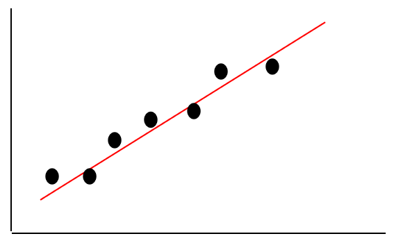

# 5.1:线性回归算法思想

### 简单线性回归

在生活中，我们常常能碰到这么一种情况，一个变量会跟着另一个变量的变化而变化，如圆的周长与半径的关系，当圆的半径确定了，那么周长也就确定了。还有一种情况就是，两个变量之间看似存在某种关系，但又没那么确定，如青少年的身高与体重，他们存在一种近似的**线性**关系：

`身高/cm = 体重/kg +105`

但是，并不是每个青少年都符合这个公式，只能说每个青少年的身高体重都存在这么一种近似的线性关系。这就是其实就是简单的**线性回归**，那么，到底什么是线性回归呢？假如我们将青少年的身高和体重值作为坐标，不同人的身高体重就会在平面上构成不同的坐标点，然后用一条直线，尽可能的去拟合这些点，这就是简单的线性回归。

简单的线性回归模型如下：

$$
y = wx+b
$$

其中`x`表示特征值(如：体重值)，`w`表示权重，`b`表示偏置，`y`表示标签(如：身高值)。

### 多元线性回归

简单线性回归中，一个变量跟另一个变量的变化而变化，但是生活中，还有很多变量，可能由多个变量的变化决定着它的变化，比如房价，影响它的因素可能有：房屋面积、地理位置等等。如果我们要给它们建立出近似的线性关系，这就是多元线性回归，多元线性回归模型如下：

$$
y=b+w_1x_1+w_2x_2+...+w_nx_n
$$

其中，$$x_i$$表示第`i`个特征，$$w_i$$表示第`i`个特征对于的权重，`b`表示偏置，`y`表示标签。