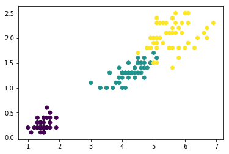

# 7.5:实战案例

### 鸢尾花数据

本次我们使用的仍然是鸢尾花数据，不过为了能够进行可视化我们只使用数据中的两个特征：

```python
from sklearn.datasets import load_iris

iris = load_iris()
x,y = iris.data,iris.target
x = x[:,2:]
```

可视化数据分布：

```python
import matplotlib.pyplot as plt

plt.scatter(x[:,0],x[:,1])
plt.show()
```

可视化结果：


我们可以先根据数据的真实标签查看数据类别情况：

```python
import matplotlib.pyplot as plt

plt.scatter(x[:,0],x[:,1],c=y)
plt.show()
```

效果如下：



### 进行聚类

最后，使用我们实现的`k-means`方法对数据进行聚类并查看聚类效果：

```python
predict = predict(3,x,500,0.0001)

plt.scatter(x[:,0],x[:,1],c=predict)
plt.show()
```


可以发现，使用实现的方法进行聚类的结果与真实情况非常吻合。